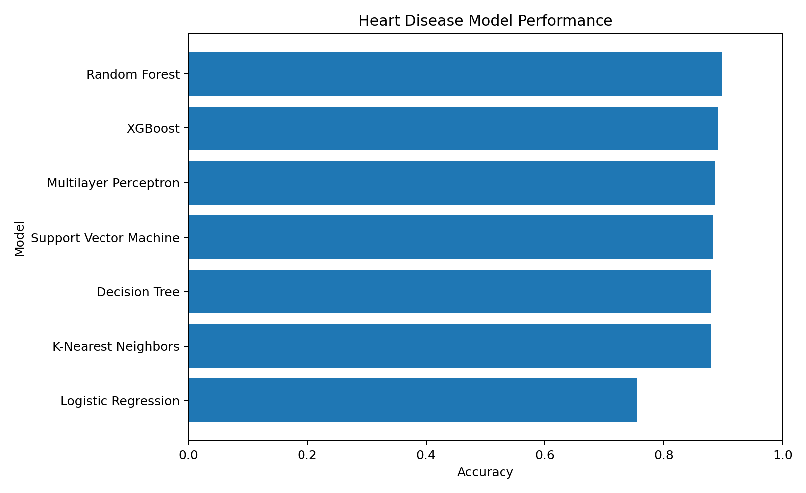
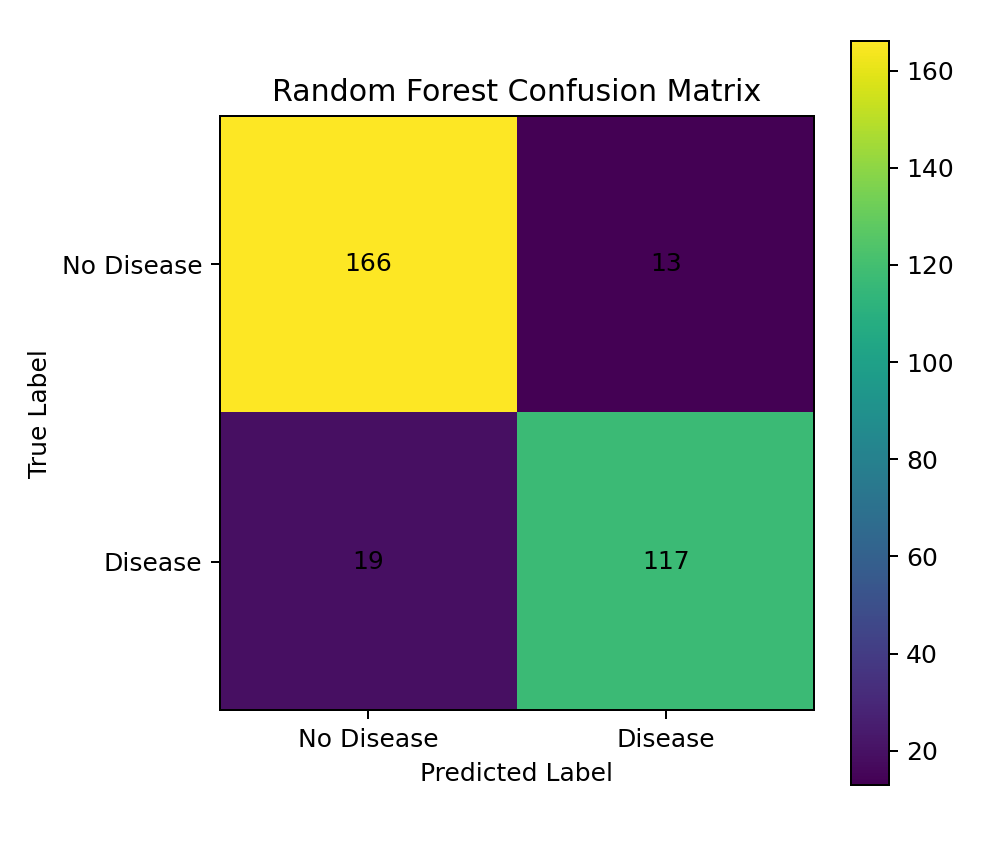
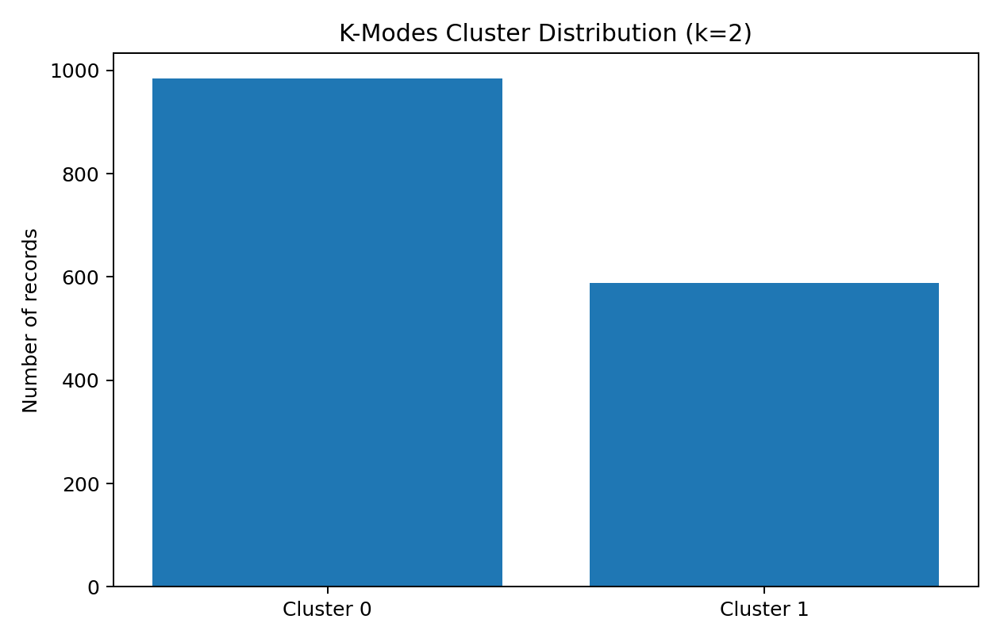

# Heart Disease Prediction System

A machine learning project for comparative heart disease prediction using three standardized clinical datasets. The workflow combines data integration, preprocessing, exploratory data analysis, feature selection, feature scaling, supervised model comparison, and K-Modes clustering.

## Project Highlights

- Integrated **1,573 patient records** from three input datasets.
- Standardized the datasets to a common 14-column structure.
- Applied median/mode missing-value imputation and categorical encoding.
- Used **SelectKBest with chi-square scoring** to select the top 10 features.
- Compared seven supervised learning models.
- Applied K-Modes clustering for unsupervised patient segmentation.
- Evaluated classification performance using accuracy, precision, recall, F1-score, and confusion matrices.

## Dataset

The executed notebook loads:

| Dataset | Records |
|---|---:|
| `dataset_1.csv` | 1,000 |
| `dataset_2.csv` | 270 |
| `dataset_3.csv` | 303 |
| **Merged dataset** | **1,573** |

The standardized feature set contains 13 predictors plus the target variable.

The datasets are not included in this repository. See [`data/README.md`](data/README.md) for setup instructions.

## Methodology

### 1. Data Integration

The project standardizes the differently formatted first dataset and combines it with the other two datasets. Features are aligned to a common schema before concatenation.

### 2. Preprocessing

The executed notebook performs:

- Median imputation for numerical missing values
- Mode imputation for categorical missing values
- Label encoding of remaining categorical columns
- Separation of predictors and target

### 3. Exploratory Data Analysis

EDA includes:

- Feature correlation analysis
- Target-class distribution analysis

### 4. Train-Test Split

The merged data is divided using an **80/20 stratified train-test split**:

- Training records: **1,258**
- Test records: **315**

### 5. Feature Selection

`SelectKBest` with the chi-square (`chi2`) scoring function selects the following 10 features:

- `age`
- `cp`
- `trestbps`
- `chol`
- `fbs`
- `restecg`
- `thalach`
- `slope`
- `ca`
- `thal`

### 6. Feature Scaling

The selected features are standardized using `StandardScaler` after feature selection.

## Models Evaluated

The supervised learning comparison includes:

- Logistic Regression
- K-Nearest Neighbors
- Support Vector Machine
- Decision Tree
- Random Forest
- Multilayer Perceptron
- XGBoost

## Results

The following table reproduces the classification results from the executed notebook:

| Model | Accuracy | Precision* | Recall* | F1* |
|---|---:|---:|---:|---:|
| Logistic Regression | 75.56% | 0.74 | 0.68 | 0.70 |
| K-Nearest Neighbors | 87.94% | 0.86 | 0.86 | 0.86 |
| Support Vector Machine | 88.25% | 0.89 | 0.83 | 0.86 |
| Decision Tree | 87.94% | 0.86 | 0.87 | 0.86 |
| **Random Forest** | **89.84%** | **0.90** | **0.86** | **0.88** |
| Multilayer Perceptron | 88.57% | 0.89 | 0.84 | 0.86 |
| XGBoost | 89.21% | 0.88 | 0.87 | 0.87 |

\* Precision, recall, and F1 shown here are for the **disease-present class (class 1)**, matching the classification reports produced by the notebook.

### Key Result

Random Forest produced the highest test-set accuracy in this experiment:

- **Accuracy: 89.84%**
- **Precision: 0.90**
- **Recall: 0.86**
- **F1-score: 0.88**

These results describe this project's held-out test set and should not be interpreted as clinical diagnostic performance.

## Visual Results

### Model Performance



### Random Forest Confusion Matrix



## Unsupervised Analysis: K-Modes

K-Modes clustering was applied separately from the supervised classification workflow.

The notebook evaluates cluster counts from 1 to 5 using an elbow-style cost analysis and then uses **k = 2** for the final clustering.

The executed notebook produced:

- Cluster 0: **984 records**
- Cluster 1: **589 records**



The clustering is exploratory and is intended to identify patterns in the structured patient data rather than provide a clinical risk diagnosis.

## Technologies

- Python
- Pandas
- NumPy
- Matplotlib
- Seaborn
- Scikit-learn
- XGBoost
- KModes
- Google Colab

## Repository Structure

```text
Heart-Disease-Prediction/
├── README.md
├── heart_disease_prediction.ipynb
├── requirements.txt
├── data/
│   └── README.md
└── images/
    ├── model_performance.png
    ├── random_forest_confusion_matrix.png
    └── kmodes_cluster_distribution.png
```

## How to Run

### 1. Clone the repository

```bash
git clone https://github.com/ishikach21/Heart-Disease-Prediction.git
cd Heart-Disease-Prediction
```

### 2. Install dependencies

```bash
pip install -r requirements.txt
```

### 3. Add the datasets

Place `dataset_1.csv`, `dataset_2.csv`, and `dataset_3.csv` inside the `data/` directory.

### 4. Open the notebook

Open `heart_disease_prediction.ipynb` in Jupyter or Google Colab and run the cells sequentially.

> The original notebook was developed in Google Colab. Dataset paths should point to the repository's `data/` directory when running locally.

## Links

GitHub: https://github.com/ishikach21
